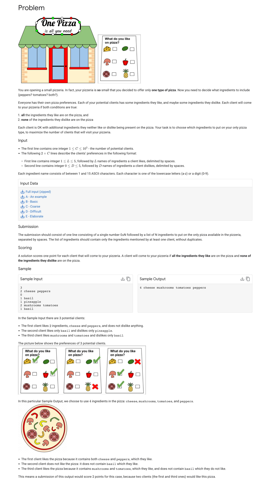
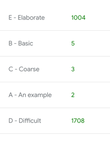

# One Pizza

This is a Google coding competitions practice preparing to the hashcode competition.

https://codingcompetitions.withgoogle.com/hashcode

## The test

## The result

All input data are stored here, in the input_data.
The program take all of them and compute them before creating an output file used to complete the practice test.

Actual Score: 

